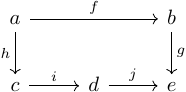

### 3. 複数の観測者が同じものを見ているとはどういうことか

#### 数学的準備

##### 定義3-1 可換図式
例えば下の図において、**図式が可換である**とは\(gf=jih\)が成り立つことをいいます。一般的に、図式が可換であるとは、対象\(x\)から\(y\)への経路が2つ以上あるならばそのすべてについて、経路に沿った合成で得られる\(x\)から\(y\)への射が等しいことをいいます。

  
  
図3-1 図式の例

 

##### 定義3-2 積
\(A\)を圏とします。対象\(x,y \in A\)について、\(x\)と\(y\)の**積**とは、下の図式における\(p,p_0,p_1\)の組であり、「任意の\(a \in \mathrm{ob}(A),f_0 \in A(a,x), f_1 \in A(a,y)\)に対し以下の図式を可換にする射\(f:a \to p\)がだたひとつ存在する」という条件を満たすもののことです。

  
  
図3-2 積の定義

 

##### 定義3-3 関手
\(A,B\)を圏とします。**関手**\(F:A \to B\)とは、
- \(a \mapsto F(a)\)と書かれる関数
$$
  \mathrm{ob}(A) \to \mathrm{ob}(B)
$$
- \(a,a' \in A\)について\(f \mapsto F(f)\)と書かれる関数
$$
  A(a,a') \to B(F(a),F(a'))
$$

からなり、以下の公理を満たすもののことです。
- \(a \overset{f}{\to} a' \overset{f'}{\to} a''\)となる\(A\)の射\(f,f''\)について\(F(f' \circ f)=F(f') \circ F(f)\)
- \(a \in A\)について\(F(1_a)=1_{F(a)}\)

注：関手は、**圏から圏への射**として解釈できます。

##### 定義3-4 小圏、局所小圏
圏\(A\)が**小さい**または**小圏**であるとは、\(A\)の射の集まりが集合をなすことをいい、そうでないとき**大きい**といいます。
圏\(A\)が**局所小**であるとは、任意の\(a,b\)について\(A(a,b)\)が集合をなすことをいいます。
注：本書で「集まり」といういささかあいまいな言葉が用いられてきたのは、こういった事情があります。ただし、本書に登場する圏のほとんどは少なくとも局所小です。

##### 定義3-5 集合の圏Set
**集合の圏**\(\textbf{Set}\)とは、任意の集合を対象として持ち、集合から集合への関数を射として持つ圏です。
注1：本書ではこれ以上厳密な定義に踏み込むことは避けます。
注2：\(\textbf{Set}\)は局所小ですが、小さい圏ではありません。

##### 定義3-6 Hom関手
\(A\)を局所小圏とします。\(a \in A\)について、**Hom関手**と呼ばれる関手
$$
  H^a = A(a,-):A \to \textbf{Set}
$$
を以下のように定義します。
- 任意の対象\(b \in A\)について\(H^a(b)=A(a,b)\)
- \(A\)の射\(b \overset{g}{\to} b'\)について
$$
\begin{aligned}
  H^a(g) = A(a,g):A(a,b) &\to A(a,b') \\
  p &\mapsto g \circ p
\end{aligned}
$$

##### 定義3-7 自然変換
\(A,B\)を圏とし、\(F,G:A \to B\)を関手とします。**自然変換**\(\alpha :F \to G\)とは\(B\)における射の集まり\((F(a) \overset{\alpha_a}{\to} G(a))_{a \in A}\)であって、\(A\)の任意の射\(a \overset{f}{\to} a'\)について、以下の図式を可換にするものをいいます。射\(\alpha_a\)は\(\alpha\)の**成分**と呼ばれます。

  
  
図3-4 自然変換の定義

 

注1：自然変換は、関手から関手への射として解釈できます。射の間に射があるという、少々奇妙な概念です。
注2：自然変換\(\alpha\)は、以下のように図示されることがあります。

  
  
図3-5 自然変換の図示

 

##### 定義3-8 逆射、同型射

#### 部分視の定義

##### 定義3-9
\(A,B\)を観測者とします。\(A\)が\(B\)について**部分視している**とは、以下の図式において\(H^{w_A}\circ p_A\)から\(H^{w_B}\circ p_B\)への自然変換\(\alpha\)が存在することをいいます。また、この\(\alpha\)のことを\(A\)から\(B\)への**部分視**といいます。ただし、\(p_A,p_B\)はそれぞれ\(A\times B\)から\(A,B\)への射影、\(H^{w_A},H^{w_B}\)はそれぞれ\(A,B\)から\(\textbf{Set}\)への世界対象に関するHom関手です。

  
  
図3- 部分視の定義

 

#### 同じものを見ていることの定義

##### 定義3-
\(A,B\)を観測者、\(\alpha\)を\(A\)から\(B\)への部分視とします。**\(A\)と\(B\)が同じものを見ている**とは、\(\alpha\)が同型射であるということです。